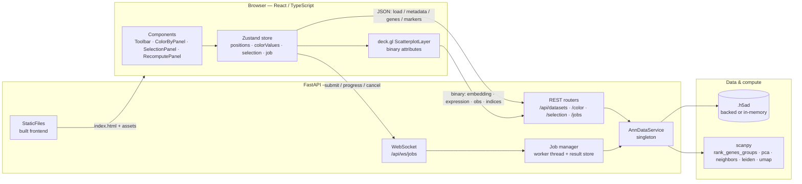

<!-- SPDX-License-Identifier: GPL-3.0-or-later -->

# CellScope

> Self-hostable, GPU-accelerated browser for single-cell RNA-seq embeddings — load an `.h5ad`, explore up to ~5M cells at interactive frame rates, color by gene or metadata, lasso/box select, and recompute Leiden clustering or UMAP on a subset.

[](LICENSE)
[](.github/workflows/ci.yml)
[](backend/pyproject.toml)
[](frontend/tsconfig.json)

 <!-- placeholder GIF — not committed yet; see the comment below -->


<!--
PLACEHOLDER: the image above points at docs/media/demo.gif, which is not committed yet.
To add a real screen recording:
  1. Run the app (see Quickstart) and load the auto-generated sample dataset.
  2. Capture a short clip (pan/zoom, color-by-gene, a lasso selection, a recompute) with
     a recorder such as `peek` (Linux), ScreenToGif (Windows), or `Gifski` (macOS).
  3. Keep it small (<= ~5 MB, <= ~15 s, ~1000px wide) so the repo stays lean.
  4. Save it as docs/media/demo.gif (create the docs/media/ directory) and commit it.
A still PNG named docs/media/screenshot.png is a fine fallback if a GIF is too large.
-->

---

## What it is / who it's for

CellScope is for **researchers and bioinformaticians** who have a single-cell dataset
already embedded (UMAP / t-SNE / PCA stored in `adata.obsm`) and want to *explore* it
interactively without writing notebook code for every question.

Point it at an `.h5ad` file and you get a fast, pannable scatter of the embedding, the
ability to color by any gene's expression or any `obs` metadata column, marker-gene
statistics for arbitrary selections, and on-the-fly re-clustering / re-embedding of a
selected subpopulation. It is designed to stay responsive on datasets up to roughly
**5 million cells** by treating cell coordinates and per-cell values as raw binary typed
arrays end-to-end and rendering them with deck.gl's binary attribute path.

It is **self-hostable**: a single Docker image, a single port, no external services, no
cloud dependency. Your data never leaves your machine.

It is **not** an analysis pipeline or a replacement for scanpy/Seurat — it complements
them. You do your QC, normalization, and initial embedding upstream; CellScope is the
interactive lens over the result.

---

## Features

1. **AnnData loader (in-memory or backed).** Load an `.h5ad` by server-side path or
   multipart upload. Files at or above a configurable threshold
   (`CELLSCOPE_BACKED_THRESHOLD_MB`, default 500 MB) are opened in **backed mode**
   (`anndata.read_h5ad(path, backed="r")`): `obs`, `var`, and `obsm` live in RAM while
   `X` stays on disk, so embeddings and metadata are cheap and only gene-expression reads
   touch the disk.
2. **GPU viewport with pan / zoom / hover.** A deck.gl `ScatterplotLayer` fed by *binary
   attributes* (`getPosition` as interleaved-xy `Float32Array`, `getFillColor` as
   `Uint8Array`) — no per-row JavaScript objects. Hover surfaces the cell index and its
   current color value.
3. **Color by gene or `obs` column.** Case-insensitive gene search; expression streamed as
   a flat `Float32Array` (one read of a single column). Categorical `obs` columns arrive as
   `Int32` codes indexing a category list sent at load time; continuous columns arrive as
   `Float32`. Color mapping (viridis, etc.) happens client-side.
4. **Box + lasso selection with marker stats.** Selections are computed in data space on
   the client, registered server-side (raw `Int32` index array — scales to millions), and
   referenced by `selection_id`. Stats include per-column `obs` summaries and **marker
   genes** via scanpy `rank_genes_groups` (Wilcoxon) comparing the selection against a
   random sample of the rest.
5. **On-the-fly Leiden / UMAP recompute over WebSocket.** Submit a `recluster` or
   `recompute_umap` job for the current selection; progress (`subset` → `pca` →
   `neighbors` → `leiden`/`umap` → `finalize`) streams back over `/api/ws/jobs`, and the
   result is downloaded as a binary `Int32` label array or interleaved-xy `Float32`
   coordinate array.
6. **Performance + downsampling fallback.** The binary protocol and deck.gl binary
   attributes target 60fps at ~1M points on a discrete GPU. When the device can't keep up,
   a downsampling fallback renders a representative subset (`downsampleN`) while keeping the
   full dataset registered server-side for selection and stats.

---

## Quickstart

### Docker (recommended)

```bash
docker compose up
```

Then open **<http://localhost:8000>**.

On first start, a small **synthetic sample dataset is auto-generated and loaded**, so the
viewport is populated immediately — no download or upload needed to try the app. (The
sample is produced by [`examples/generate_sample.py`](examples/generate_sample.py) and
requires no network access.) To use your own data, drop `.h5ad` files into the data
directory (`CELLSCOPE_DATA_DIR`, default `./data`) or upload one through the UI.

### Local development

Run the backend and frontend separately for hot reload. The Vite dev server proxies
`/api` to the backend on port 8000.

**Backend** (FastAPI + Uvicorn):

```bash
cd backend
python -m venv .venv && source .venv/bin/activate   # Windows: .venv\Scripts\activate
pip install -e .                                     # or: pip install -r requirements.txt
uvicorn app.main:app --reload --port 8000
```

**Frontend** (React + Vite + deck.gl):

```bash
cd frontend
npm install
npm run dev                                          # serves http://localhost:5173
```

Open **<http://localhost:5173>** for the dev UI; API calls are proxied to `:8000`. In
production the frontend is built to static assets and served by FastAPI's `StaticFiles`
from the same origin/port — see [`docs/architecture.md`](docs/architecture.md).

Configuration is via environment variables (host, port, data dir, backed-mode threshold,
upload cap, marker "rest" cap, selection LRU size, autoload path, CORS). The full table
lives in [§3 of the contract](docs/CONTRACT.md#3-configuration-env-vars-read-by-configpy).

---

## Architecture



### Binary transfer protocol

The performance story is that **cell coordinates and per-cell values never travel as
JSON**. They move as raw little-endian typed arrays with `X-Cellscope-*` headers; JSON is
reserved for schema, metadata, and marker/stats results. This is the human-friendly
summary — [§4](docs/CONTRACT.md#4-rest-api-prefix-api) and
[§9](docs/CONTRACT.md#9-binary-protocol-invariants-the-heart-of-the-perf-story) of the
contract (and [`docs/protocol.md`](docs/protocol.md)) are authoritative.

```mermaid
sequenceDiagram
  participant C as Client (binary.ts)
  participant A as API (/api)
  participant S as AnnDataService

  C->>A: POST /datasets/load { path }
  A->>S: load() — open backed or in-memory
  A-->>C: JSON DatasetInfo (n_obs, embeddings, obs_columns…)

  C->>A: GET /datasets/{id}/embedding?key=X_umap
  A->>S: get_embedding() → float32[n,2] C-contiguous
  Note over A,C: X-Cellscope-Dtype: float32<br/>X-Cellscope-Layout: interleaved-xy<br/>X-Cellscope-N-Obs · X-Cellscope-Bounds
  A-->>C: octet-stream Float32 (2·n, xy interleaved)

  C->>A: GET /datasets/{id}/expression?gene=CD3D
  A->>S: get_expression() → float32[n] (one column read)
  Note over A,C: X-Cellscope-N-Obs · X-Cellscope-Min/Max · X-Cellscope-Gene
  A-->>C: octet-stream Float32 (n, flat)

  C->>C: assert elements == X-Cellscope-N-Obs; build Uint8Array color buffer
```

| Endpoint | Body dtype | Layout | Key headers |
|---|---|---|---|
| `GET /api/datasets/{id}/embedding` | Float32 | interleaved xy (`2·n_obs`, `size:2`) | `X-Cellscope-Dtype: float32`, `X-Cellscope-Layout: interleaved-xy`, `X-Cellscope-N-Obs`, `X-Cellscope-Key`, `X-Cellscope-Bounds` |
| `GET /api/datasets/{id}/expression` | Float32 | flat (`n_obs`, `size:1`) | `X-Cellscope-Dtype: float32`, `X-Cellscope-N-Obs`, `X-Cellscope-Gene`, `X-Cellscope-Min`, `X-Cellscope-Max` |
| `GET /api/datasets/{id}/obs` (categorical) | Int32 | flat codes (`n_obs`; `-1` = missing) | `X-Cellscope-Kind: categorical`, `X-Cellscope-Dtype: int32`, `X-Cellscope-N-Categories`, `X-Cellscope-N-Obs` |
| `GET /api/datasets/{id}/obs` (continuous) | Float32 | flat (`n_obs`; `NaN` allowed) | `X-Cellscope-Kind: continuous`, `X-Cellscope-Dtype: float32`, `X-Cellscope-Min`, `X-Cellscope-Max`, `X-Cellscope-N-Obs` |
| `POST /api/datasets/{id}/selection` | Int32 (request) | flat cell indices in `[0, n_obs)` | request `application/octet-stream`; response JSON `SelectionRef` |
| `GET /api/jobs/{job_id}/result` (`recluster`) | Int32 | flat labels (`n_selected`, selection order) | `X-Cellscope-Job-Type: recluster`, `X-Cellscope-N`, `X-Cellscope-N-Clusters`, `X-Cellscope-Dtype: int32` |
| `GET /api/jobs/{job_id}/result` (`recompute_umap`) | Float32 | interleaved xy (`2·n_selected`) | `X-Cellscope-Job-Type: recompute_umap`, `X-Cellscope-N`, `X-Cellscope-Bounds`, `X-Cellscope-Dtype: float32` |
| metadata / gene search / selection stats / markers | — (JSON) | — | standard JSON; see DTOs in [§6](docs/CONTRACT.md#6-shared-dtos-pydantic--typescript-must-match-field-names-exactly) |

**Invariants** (verbatim from [§9](docs/CONTRACT.md#9-binary-protocol-invariants-the-heart-of-the-perf-story)): everything is little-endian with no
padding; `X-Cellscope-N-Obs` is always echoed and the client asserts
`byteLength / 4 == n_obs`; Float32 for coordinates and continuous values, Int32 for
categorical codes and cell indices, never mixed in one buffer; embeddings and recomputed
UMAP are interleaved xy (`size:2`), per-cell scalars are flat (`size:1`); deck.gl consumes
them directly as binary attributes.

---

## Performance

> **These numbers are ESTIMATED / EXPECTED design targets, derived from the deck.gl
> binary-attribute rendering path and the binary protocol design. They have NOT been
> benchmarked on this machine.** Methodology, the exact hardware assumptions, and any real
> measurements live in [`docs/performance.md`](docs/performance.md). Treat the table as a
> design goal, not a measured result.

| Cells | Render frame rate (target) | Embedding load (target) | Notes |
|---|---|---|---|
| 50k | ~60fps | < 0.2 s | trivially interactive; fits in memory |
| 250k | ~60fps | ~0.5 s | comfortable on a discrete GPU |
| 1M | ~60fps target | ~1–2 s | the headline target; binary attributes, no JS objects |
| ~5M | interactive (≥ ~30fps) target; **downsampling fallback** otherwise | a few seconds | full set kept server-side; rendered subset capped by `downsampleN` |

**Honest caveats about the slow paths:**

- The **fast path** is GPU scatter rendering: deck.gl draws from binary attributes, so pan/
  zoom cost is dominated by the GPU, not JavaScript. ~1M points at 60fps assumes a
  **discrete GPU**; integrated GPUs will be slower and may need downsampling earlier.
- In **backed mode**, the slow paths are **per-column expression reads** (color-by-gene
  hits disk for one CSR/CSC column) and **marker computation** (subsetting the selection
  plus a sampled "rest" into memory, then scanpy `rank_genes_groups`). These are seconds-
  scale on large backed datasets, not frame-rate-scale.
- **Lasso/box selection is computed CPU-side** in the browser (point-in-polygon over the
  positions array). It is fast for typical selections but is not GPU-accelerated.
- **Recompute jobs run in a single worker thread per process** — one heavy job at a time.

See [`docs/performance.md`](docs/performance.md) for how to reproduce and record real
numbers on your hardware.

---

## Project layout

```
cellscope/
├── README.md                  # you are here
├── docker-compose.yml         # docker compose up → http://localhost:8000
├── docs/
│   ├── CONTRACT.md            # ← AUTHORITATIVE interface spec (source of truth)
│   ├── architecture.md
│   ├── protocol.md            # human summary of the binary + WS protocol
│   ├── performance.md         # benchmark methodology + (future) real numbers
│   └── cookbook/              # task-oriented walkthroughs (PBMC3k, markers, atlas scale)
├── backend/                   # FastAPI app, AnnDataService, serialization, jobs
│   └── app/{main,config,models,serialization,jobs}.py + routers/ + services/
├── frontend/                  # React + TypeScript + Vite + deck.gl + Zustand
│   └── src/{api,store,lib,hooks,components}/
├── docker/                    # multi-stage Dockerfile + entrypoint
└── examples/
    ├── README.md              # how to generate / download the example datasets
    ├── generate_sample.py     # synthetic .h5ad (no network) — the auto-loaded sample
    └── download_pbmc3k.py     # fetch real 10x PBMC3k via scanpy
```

The single source of truth for every endpoint, header, DTO field name, store shape, and
service signature is **[`docs/CONTRACT.md`](docs/CONTRACT.md)**. If code and the README ever
disagree, the contract wins.

---

## Limitations / Roadmap

CellScope is early and deliberately scoped. Known limitations (and likely next steps):

- **No authentication or multi-user support yet.** Anyone who can reach the port can load
  data and submit jobs. Run it behind your own access control; do not expose it to an
  untrusted network. *(Roadmap: optional auth + per-session datasets.)*
- **Marker stats subsample the rest.** `rank_genes_groups` compares the selection against a
  *random sample* of the remaining cells, capped at `CELLSCOPE_MARKER_REST_CAP` (default
  50k). The response reports the cap actually applied, but results are approximate on very
  large datasets.
- **Backed-mode CSR/CSC expression reads can be slow.** Color-by-gene on a large backed
  file reads a column from disk; sparse-matrix layout matters. *(Roadmap: column caching /
  optional dense layer.)*
- **Single-process, single-threaded job execution.** One recompute (Leiden/UMAP) runs at a
  time per process; there is no distributed job queue.
- **Lasso selection is CPU-side** (point-in-polygon in the browser), not GPU-accelerated.
- **No persistence of recomputed results.** Re-clustering and re-embedding outputs live in
  memory for the session and are not written back to the `.h5ad`. *(Roadmap: optional
  export of recomputed labels/coords.)*
- **Tested on synthetic + small real data only.** The auto-generated sample and small real
  datasets (e.g. 10x PBMC3k) are exercised; the ~5M-cell targets are *design goals*, not
  measured results — see [Performance](#performance) and
  [`docs/performance.md`](docs/performance.md).
- **2D embeddings only.** Only the first two columns of an `obsm` `X_*` key are rendered.

---

## License

CellScope is licensed under the **GNU General Public License v3.0 or later
(GPL-3.0-or-later)**. See [`LICENSE`](LICENSE) for the full text. Every source file carries
an SPDX header.

## Contributing

Contributions are welcome. The most important rule: **the contract comes first.** If your
change alters any interface (endpoint, header, dtype, DTO field, store shape, or service
signature), open a PR against [`docs/CONTRACT.md`](docs/CONTRACT.md) *before or alongside*
the implementation. Code that disagrees with the contract is a bug.

Conventions (full details in [§10 of the contract](docs/CONTRACT.md#10-conventions)):

- **Python**: 3.11 target, full type hints, Google-style docstrings, `ruff` clean,
  `logging` (never `print`), SPDX header.
- **TypeScript**: strict mode, no `any` in exported signatures, TSDoc on exported
  functions, ESLint clean, functional React + hooks, SPDX header.
- **Tests**: pytest with synthetic AnnData fixtures (never download data in tests); assert
  binary header values and `byteLength`.

Builds and tests run in CI — please keep the host lean and let CI do the heavy lifting.
