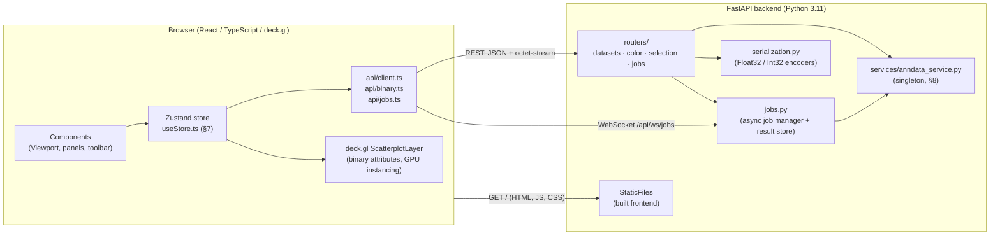

# CellScope — Architecture

> This document explains *how the pieces fit together*. The authoritative interface
> contract (file layout, exact paths, headers, DTOs, store shape, service signatures)
> lives in [`CONTRACT.md`](./CONTRACT.md). Where this doc and the contract disagree,
> the contract wins. Section references like "§1" point at `CONTRACT.md`.

---

## 1. The client / server split

CellScope is a **single-image, single-port** application: a FastAPI backend that both
serves the REST + WebSocket API under `/api` and (in production) serves the compiled
React frontend as static files from the same origin. Default port **8000** (§1, §3).



The split is deliberately thin. The server is the **single source of truth for cell
data**: it owns the AnnData object, decides categorical vs. continuous, computes
markers, and runs recompute jobs. The client owns **interaction and rendering**:
camera, lasso/box geometry, colormap application, and the GPU upload of binary
buffers. The wire between them is the binary protocol (§4, §9): coordinates and
per-cell scalars travel as raw little-endian typed arrays; JSON is reserved for
schema, metadata, and markers.

### Why this boundary

- **The browser cannot hold 5M rows of JS objects.** Anything per-cell must arrive as
  a typed array and feed deck.gl directly as a binary attribute (§9.5). So the server's
  job is to emit `Float32Array` / `Int32Array` blobs, and the client's job is to never
  materialize per-point objects.
- **Selection logic lives where the geometry is.** Point-in-polygon and box tests run
  client-side in data space (`lib/selection.ts`) because the positions are already on
  the client; only the resulting index list is POSTed back (§4.7) as an `Int32Array`.
- **Compute lives where the data is.** Markers and recompute (Leiden/UMAP) need the
  expression matrix, which only exists server-side, so they are server endpoints / jobs.

---

## 2. Module map

The full, authoritative file tree is **§1 of the contract**. The functional grouping:

| Layer | Files | Responsibility |
|---|---|---|
| **Backend entry** | `backend/app/main.py`, `config.py` | FastAPI app factory, static mount, settings from env (§3). |
| **Backend contracts** | `backend/app/models.py` | pydantic DTOs mirroring §6. |
| **Backend wire** | `backend/app/serialization.py` | Float32/Int32 encode/decode, header helpers (§4, §9). |
| **Backend data** | `backend/app/services/anndata_service.py` | Lazy/backed AnnData I/O + compute (§8). Singleton `service`. |
| **Backend jobs** | `backend/app/jobs.py` | Async job manager, worker thread, result store (§5, §4.8). |
| **Backend routes** | `backend/app/routers/{datasets,color,selection,jobs}.py` | HTTP + WS endpoints (§4, §5). |
| **Frontend types** | `frontend/src/types.ts` | TS mirror of §6 DTOs + §4 protocol shapes. |
| **Frontend API** | `frontend/src/api/{client,binary,jobs}.ts` | REST fetch (incl. binary), ArrayBuffer parsing, WS client. |
| **Frontend state** | `frontend/src/store/useStore.ts` | Zustand store (§7) + actions. |
| **Frontend render** | `frontend/src/components/EmbeddingViewport.tsx`, `hooks/useColorBuffer.ts`, `lib/colormap.ts` | deck.gl layer, color buffer build, colormaps. |
| **Frontend interaction** | `frontend/src/components/{Toolbar,FileLoader,ColorByPanel,SelectionPanel,RecomputePanel,Tooltip}.tsx`, `lib/selection.ts` | Panels, lasso/box geometry. |

A request always flows **router → service → serialization** on the way out, and
**binary.ts → store → useColorBuffer/Viewport** on the way in.

---

## 3. Request flow: loading a dataset

```mermaid
sequenceDiagram
  participant U as User
  participant FE as Frontend (store + client.ts)
  participant R as routers/datasets.py
  participant S as anndata_service.py
  participant FS as Disk (.h5ad)

  U->>FE: pick file / path
  FE->>R: POST /api/datasets/load  { path } (§4.1)
  R->>S: service.load(path)
  S->>FS: anndata.read_h5ad(path, backed=?)
  Note over S,FS: backed="r" if file ≥ BACKED_THRESHOLD_MB,<br/>else fully in-memory (§2)
  S-->>R: DatasetInfo (§6.1) incl. embeddings, obs_columns w/ categories
  R-->>FE: 200 DatasetInfo (JSON)
  FE->>FE: store.dataset = info; pick default_embedding
  FE->>R: GET /api/datasets/{id}/embedding?key=X_umap (§4.5)
  R->>S: service.get_embedding(id, key)
  S-->>R: float32 [n,2] C-contiguous + bounds
  R-->>FE: octet-stream (interleaved xy)<br/>X-Cellscope-N-Obs, -Bounds, -Layout, -Key, -Dtype
  FE->>FE: binary.ts → Float32Array; assert len/2 == N-Obs
  FE->>FE: store.positions, bounds, nObs set
  Note over FE: deck.gl uploads positions as binary attribute (size:2)
```

Two round trips: a small JSON `DatasetInfo` (which already carries the
`obs_columns[*].categories` so categorical labels are known up front — §4.6), then a
single large binary embedding blob. Nothing else is needed to render the base scatter.

---

## 4. Request flow: coloring by gene

```mermaid
sequenceDiagram
  participant FE as Frontend
  participant R as routers/color.py
  participant S as anndata_service.py
  participant X as adata.X (disk if backed)

  FE->>R: GET /api/datasets/{id}/genes?query=cd3&limit=50 (§4.6)
  R->>S: service.search_genes(...)
  S-->>R: { hits: GeneHit[], total }
  R-->>FE: JSON; user clicks "CD3D"
  FE->>R: GET /api/datasets/{id}/expression?gene=CD3D&layer=X
  R->>S: service.get_expression(id, "CD3D", "X")
  S->>X: read ONE column (one gene) for all cells
  Note over S,X: backed CSR → per-column read is a slow path (perf.md §6)
  S-->>R: float32 [n], resolved_name, vmin, vmax
  R-->>FE: octet-stream + X-Cellscope-Gene, -Min, -Max, -N-Obs
  FE->>FE: binary.ts → Float32Array (size:1, flat)
  FE->>FE: store.colorValues + colorKind="continuous" + colorDomain=[min,max]
  FE->>FE: useColorBuffer.ts → Uint8Array(n*3) via colormap
  Note over FE: deck.gl getFillColor binary attribute (size:3); no JS objects
```

Coloring an obs column (§4.6 "Obs column") is the same shape, but the server returns
either **Int32 codes** (categorical, with `X-Cellscope-Kind: categorical` and
`N-Categories`) or **Float32 values** (continuous). The category *labels* were already
delivered in `DatasetInfo`; the body is just integer codes that index that label array
(code `-1` = missing). The color buffer is rebuilt in `useColorBuffer.ts` from
`colorValues`/`colorCodes` + `colormapName` and is **never stored** (§7).

---

## 5. Request flow: select + stats (markers)

```mermaid
sequenceDiagram
  participant U as User (lasso/box)
  participant FE as Frontend (lib/selection.ts)
  participant RS as routers/selection.py
  participant S as anndata_service.py

  U->>FE: draw lasso in viewport
  FE->>FE: point-in-polygon over positions → Int32Array of indices (data space)
  FE->>RS: POST /api/datasets/{id}/selection<br/>octet-stream raw Int32 indices (§4.7)
  RS->>S: service.register_selection(id, indices)
  S-->>RS: (selection_id, n_cells)
  RS-->>FE: SelectionRef { selection_id, n_cells }
  FE->>FE: store.selection, selectionId set
  FE->>RS: POST /selection/stats { selection_id, n_markers } (§4.7)
  RS->>S: service.selection_stats(id, indices, n_markers, obs_keys)
  Note over S: load adata[selection] + random sample of rest<br/>(≤ MARKER_REST_CAP) .to_memory(), concat, label,<br/>sc.tl.rank_genes_groups(method="wilcoxon")
  S-->>RS: SelectionStatsResponse (markers, obs_summary, notes)
  RS-->>FE: JSON; notes carry honest caveats (e.g. "rest subsampled to 50000")
  FE->>FE: store.selectionStats; SelectionPanel renders markers + obs summary
```

The selection is computed entirely client-side (the positions are already there) and
sent back as a compact `Int32Array` body — this scales to millions of indices without
JSON overhead (§4.7). The server registers it in an LRU (default 64, §2/§3) keyed by
`selection_id`, so the subsequent stats call can reference it by id rather than
re-sending indices. Markers compare the selection against a *random sample of the rest*
capped at `CELLSCOPE_MARKER_REST_CAP` (default 50000); the actual cap applied is
reported back in `rest_cells_used` and `notes` (§6.5).

---

## 6. Request flow: a recompute job over WebSocket

Recompute (recluster or recompute_umap) is long-running, so it does **not** use a
blocking HTTP request. The client submits over the WebSocket `/api/ws/jobs` (§5), the
server runs the work in a worker thread, pushes `progress` frames, and on completion
hands back a `result_url` that the client `GET`s as a binary buffer (§4.8).

```mermaid
sequenceDiagram
  participant FE as Frontend (api/jobs.ts)
  participant WS as routers/jobs.py (/api/ws/jobs)
  participant JM as jobs.py (job manager)
  participant W as Worker thread
  participant S as anndata_service.py
  participant RES as GET /api/jobs/{id}/result

  FE->>WS: { action:"submit", job_type:"recompute_umap",<br/>dataset_id, selection_id, params } (§5, §6.6)
  WS->>JM: create job
  JM-->>FE: { type:"accepted", job_id, job_type }
  JM->>W: dispatch
  W->>S: recompute_umap(id, indices, params, progress)
  Note over S,W: subset to selection .to_memory();<br/>reuse X_pca rows if present, else sc.pp.pca;<br/>sc.pp.neighbors → sc.tl.umap (§8)
  loop as compute advances
    S-->>W: progress(step, frac, msg)
    W-->>FE: { type:"progress", job_id, step, progress, message }
    Note right of FE: steps: subset·pca·neighbors·leiden·umap·finalize<br/>(tolerate unknown steps)
  end
  W->>JM: store result (float32 [2n] + bounds)
  JM-->>FE: { type:"completed", job_id, job_type,<br/>result_url:"/api/jobs/<id>/result", summary }
  FE->>RES: GET /api/jobs/{job_id}/result (§4.8)
  RES-->>FE: octet-stream Float32 [2*n_selected] interleaved xy<br/>X-Cellscope-Job-Type, -N, -Bounds, -Dtype
  FE->>FE: binary.ts → Float32Array; store.recomputedPositions (overlay/replace)
```

For a `recluster` job the lifecycle is identical, but the result (§4.8) is **Int32**
length `n_selected` (one cluster label per selected cell, in selection order) with
headers `X-Cellscope-Job-Type: recluster`, `X-Cellscope-N`, `X-Cellscope-N-Clusters`,
`X-Cellscope-Dtype: int32`. The client applies it as an ephemeral categorical coloring
(`store.reclusterLabels`, §7). The client may also send
`{ "action": "cancel", "job_id": "..." }`; the server answers with
`{ "type": "cancelled", "job_id": "..." }`. Errors arrive as
`{ "type": "error", "job_id", "error" }`.

The job lifecycle is strictly: **submit → accepted → progress\* → completed**, then a
separate **GET result** for the binary payload. The result is *not* pushed over the
socket — only its URL — so the large binary travels over a normal cacheable HTTP
response with the usual `X-Cellscope-*` headers and `byteLength` assertion.

---

## 7. Backed / lazy AnnData strategy — where memory is (and isn't) spent

This is the core of CellScope's ability to handle atlas-scale data on a modest host.

### The rule (§2)

```mermaid
flowchart TD
  A["read_h5ad(path)"] --> B{file size ≥<br/>CELLSCOPE_BACKED_THRESHOLD_MB<br/>(default 500)?}
  B -- "yes" --> C["backed='r'<br/>obs, var, obsm in RAM<br/>X stays on disk"]
  B -- "no" --> D["backed=None<br/>everything in RAM"]
```

When the `.h5ad` is at least `CELLSCOPE_BACKED_THRESHOLD_MB`, AnnData is opened with
`anndata.read_h5ad(path, backed="r")`. In that mode:

- **In RAM (cheap, always loaded):** `obs` (cell metadata), `var` (gene table), and
  `obsm` (the embeddings). These are small relative to `X` — `obsm["X_umap"]` for 5M
  cells is `5M × 2 × 4 bytes ≈ 40 MB`, and `obs`/`var` are typically tens of MB.
- **On disk (lazy):** the expression matrix `X` and any `layers`. Reads from `X` hit
  the disk on demand.

Consequence (§2): **embeddings and metadata are cheap**; the *only* disk-bound read in
the hot path is **gene expression** (one column per gene colored). Loading a dataset
and rendering its scatter never touches `X`.

### Where memory is spent, by operation

| Operation | What's in RAM | Notes |
|---|---|---|
| Load + render embedding | `obs`, `var`, `obsm`; one float32 `[n,2]` copy to encode | `X` untouched in backed mode. |
| Color by gene (backed) | One float32 `[n]` expression column | Per-column read from disk; CSR layout makes this a slow path (perf.md §6). |
| Color by obs | One int32/float32 `[n]` from `obs` (already in RAM) | No disk read. |
| Selection register | One int32 `[n_selected]` index array | Stored in LRU (≤ `CELLSCOPE_SELECTION_LRU`, default 64). |
| Markers (backed) | `adata[selection].to_memory()` + a random sample of the rest (≤ `MARKER_REST_CAP`) `.to_memory()` | Bounded by the cap, not by `n_obs` (§8). |
| Recompute (Leiden/UMAP) | `adata[selection].to_memory()`; reuse `X_pca` rows if present, else `sc.pp.pca` | Bounded by selection size; single-process (perf.md §6). |

### Tuning knobs (full list in §3; deeper guidance in performance.md)

- `CELLSCOPE_BACKED_THRESHOLD_MB` — raise it to force more datasets fully into RAM
  (faster gene reads, more memory); lower it to stay lazy on smaller hosts.
- `CELLSCOPE_MARKER_REST_CAP` — bounds the "rest" sample for marker tests; the response
  always reports the cap actually applied so results stay honest.
- `CELLSCOPE_SELECTION_LRU` — number of cached selections.
- Frontend `downsample` / `downsampleN` (§7) — stride-sample the rendered points above
  a threshold to protect frame rate; see performance.md for the trade-offs.

The backed-mode marker and recompute strategies are spelled out verbatim in §8 of the
contract and analyzed (with their slow paths) in [`performance.md`](./performance.md).
