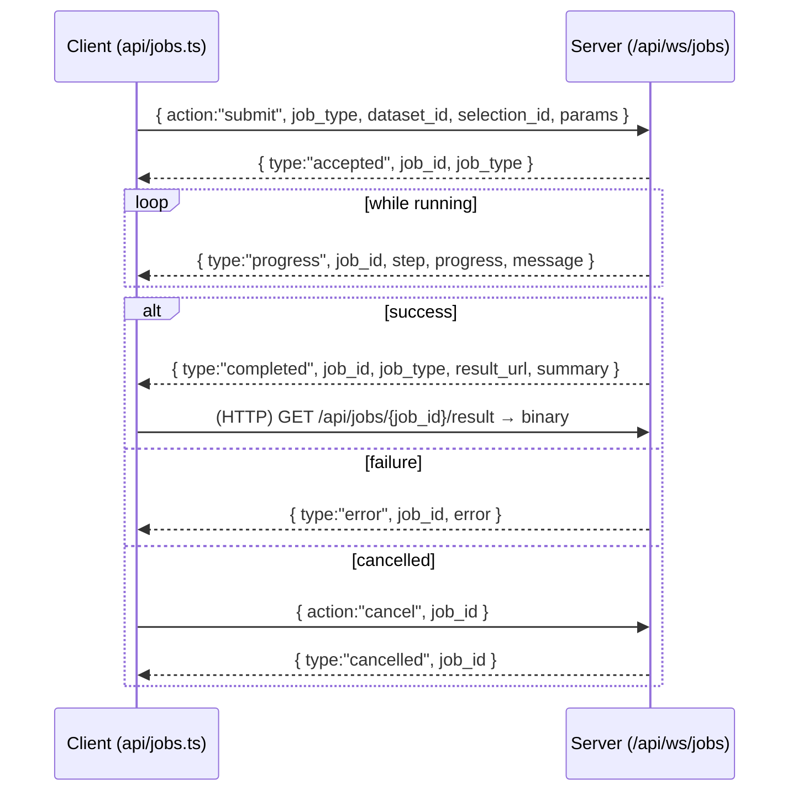

# CellScope — Wire Protocol (human-readable)

> This is a precise human restatement of the binary transfer protocol and the
> REST + WebSocket API. It is **derived from** [`CONTRACT.md`](./CONTRACT.md) §4 (REST),
> §5 (WebSocket), and §9 (binary invariants), and is kept consistent with it
> verbatim. If anything here drifts from the contract, the contract wins. Section
> references ("§4.5" etc.) point at `CONTRACT.md`.

---

## 1. Invariants (§9)

These hold for **every** binary endpoint:

1. **Raw, not JSON.** Coordinates and per-cell scalars travel as raw little-endian
   typed arrays in an `application/octet-stream` body. JSON is reserved for
   schema, metadata, and markers.
2. **`n_obs` is echoed.** Every binary response sends `X-Cellscope-N-Obs: <int>`.
   The client allocates exactly `byteLength / 4` elements and **asserts** that count
   matches the header (a 4-byte element size for both Float32 and Int32).
3. **Two dtypes only.** `Float32` for coordinates and continuous values; `Int32` for
   categorical codes and cell indices. No mixed-dtype buffers.
4. **Layout.** Embedding and recomputed-UMAP buffers are **interleaved xy**
   (`[x0,y0,x1,y1,...]`, deck.gl `size:2`). Expression / obs / labels are **flat
   per-cell** (`size:1`).
5. **Little-endian, no padding.** Buffers are tightly packed.

deck.gl consumes these directly as **binary attributes** — no per-row JS objects:

```js
const data = {
  length: n,
  attributes: {
    getPosition:  { value: positions, size: 2 }, // Float32Array, interleaved xy
    getFillColor: { value: colors,    size: 3 }, // Uint8Array, RGB
  },
};
```

All custom headers are prefixed `X-Cellscope-`. Errors are HTTP status + JSON
`{"detail": "..."}` (FastAPI default).

---

## 2. Binary endpoint reference

Each table gives the **body dtype**, the **length formula** (in *elements*; multiply
by 4 for bytes), the **layout**, and the exact `X-Cellscope-*` headers.

### 2.1 `GET /api/datasets/{id}/embedding?key=X_umap` (§4.5)

`key` defaults to the dataset's `default_embedding`. 404 on unknown dataset/key.

| Field | Value |
|---|---|
| Body dtype | `Float32` (little-endian) |
| Length (elements) | `2 * n_obs` |
| Length (bytes) | `8 * n_obs` |
| Layout | interleaved xy `[x0,y0,x1,y1,…]` (`size:2`) |

Headers:

| Header | Example | Meaning |
|---|---|---|
| `X-Cellscope-Dtype` | `float32` | element type |
| `X-Cellscope-Layout` | `interleaved-xy` | confirms `size:2` |
| `X-Cellscope-N-Obs` | `2638` | number of cells |
| `X-Cellscope-Key` | `X_umap` | resolved obsm key |
| `X-Cellscope-Bounds` | `-12.3,-9.1,14.0,11.7` | `minX,minY,maxX,maxY` (4 floats) |

### 2.2 `GET /api/datasets/{id}/expression?gene=CD3D&layer=X` (§4.6)

`gene` is a var_name or an integer var index (as a string). `layer` is optional;
`X` (default) reads `adata.X`, otherwise `adata.layers[layer]`. 404 if gene not found.

| Field | Value |
|---|---|
| Body dtype | `Float32` |
| Length (elements) | `n_obs` |
| Length (bytes) | `4 * n_obs` |
| Layout | flat per-cell (`size:1`) |

Headers:

| Header | Example | Meaning |
|---|---|---|
| `X-Cellscope-Dtype` | `float32` | element type |
| `X-Cellscope-N-Obs` | `2638` | number of cells |
| `X-Cellscope-Gene` | `CD3D` | resolved var_name |
| `X-Cellscope-Min` | `0.0` | min value (for the color domain) |
| `X-Cellscope-Max` | `6.42` | max value |

### 2.3 `GET /api/datasets/{id}/obs?column=leiden` (§4.6)

Returns **one of two shapes**, distinguished by `X-Cellscope-Kind`.

**Categorical** — body is `Int32` codes; code `-1` means NaN/missing. The category
*labels* are not in the body; they were delivered at load time in
`DatasetInfo.obs_columns[*].categories`, and the codes index that ordered array.

| Field | Value |
|---|---|
| Body dtype | `Int32` |
| Length (elements) | `n_obs` |
| Length (bytes) | `4 * n_obs` |
| Layout | flat per-cell (`size:1`) |

| Header | Example | Meaning |
|---|---|---|
| `X-Cellscope-Kind` | `categorical` | shape selector |
| `X-Cellscope-Dtype` | `int32` | element type |
| `X-Cellscope-N-Obs` | `2638` | number of cells |
| `X-Cellscope-N-Categories` | `8` | number of categories |

**Continuous** — body is `Float32`; `NaN` allowed for missing.

| Field | Value |
|---|---|
| Body dtype | `Float32` |
| Length (elements) | `n_obs` |
| Length (bytes) | `4 * n_obs` |
| Layout | flat per-cell (`size:1`) |

| Header | Example | Meaning |
|---|---|---|
| `X-Cellscope-Kind` | `continuous` | shape selector |
| `X-Cellscope-Dtype` | `float32` | element type |
| `X-Cellscope-N-Obs` | `2638` | number of cells |
| `X-Cellscope-Min` | `0.0` | color-domain min |
| `X-Cellscope-Max` | `4.31` | color-domain max |

### 2.4 `POST /api/datasets/{id}/selection` (request body is binary) (§4.7)

The **request** carries the selection. Two accepted bodies:

- `application/octet-stream`: a raw `Int32` array of cell indices (preferred; scales to
  millions). Indices must be in `[0, n_obs)`; out-of-range → **400**.
- `application/json`: `{ "indices": [int, ...] }`.

| Field (octet-stream request) | Value |
|---|---|
| Body dtype | `Int32` |
| Length (elements) | `n_selected` |
| Length (bytes) | `4 * n_selected` |
| Layout | flat (`size:1`) |

Response is JSON `SelectionRef`: `{ "selection_id": "...", "n_cells": <int> }`.

### 2.5 `GET /api/jobs/{job_id}/result` (§4.8)

Paired with the WebSocket job (see §4 below). 404 if the job is unknown or not
finished. The shape depends on the job type.

**`recluster`** — one cluster label per selected cell, in selection order.

| Field | Value |
|---|---|
| Body dtype | `Int32` |
| Length (elements) | `n_selected` |
| Length (bytes) | `4 * n_selected` |
| Layout | flat (`size:1`) |

| Header | Example |
|---|---|
| `X-Cellscope-Job-Type` | `recluster` |
| `X-Cellscope-N` | `12345` (`n_selected`) |
| `X-Cellscope-N-Clusters` | `7` |
| `X-Cellscope-Dtype` | `int32` |

**`recompute_umap`** — new coordinates for the selection.

| Field | Value |
|---|---|
| Body dtype | `Float32` |
| Length (elements) | `2 * n_selected` |
| Length (bytes) | `8 * n_selected` |
| Layout | interleaved xy (`size:2`) |

| Header | Example |
|---|---|
| `X-Cellscope-Job-Type` | `recompute_umap` |
| `X-Cellscope-N` | `12345` (`n_selected`) |
| `X-Cellscope-Bounds` | `minX,minY,maxX,maxY` |
| `X-Cellscope-Dtype` | `float32` |

> Note: the result endpoint uses the short `X-Cellscope-N` header (count of *selected*
> cells), whereas the dataset-wide binary endpoints use `X-Cellscope-N-Obs`. This is
> intentional per §4.8 vs §4.5.

---

## 3. JSON endpoints (no binary body)

| Method / Path | Request | Response | §  |
|---|---|---|---|
| `POST /api/datasets/load` | `{ "path": "<.h5ad>" }` | `DatasetInfo` (§6.1) | 4.1 |
| `POST /api/datasets/upload` | multipart `file` | `DatasetInfo`; 413 over `MAX_UPLOAD_MB` | 4.2 |
| `GET /api/datasets` | — | `{ "loaded": [DatasetSummary…], "available_files": ["pbmc3k.h5ad",…] }` | 4.3 |
| `GET /api/datasets/{id}` | — | `DatasetInfo`; 404 unknown | 4.4 |
| `GET /api/datasets/{id}/genes?query=cd3&limit=50` | — | `{ "hits": [GeneHit…], "total": <int> }` (§6.3) | 4.6 |
| `POST /api/datasets/{id}/selection/stats` | `SelectionStatsRequest` (§6.4) | `SelectionStatsResponse` (§6.5) | 4.7 |
| `GET /api/health` | — | `{ "status":"ok", "version":"<ver>" }` | 4.9 |

`SelectionStatsRequest` requires **exactly one** of `selection_id` or `indices`;
`n_markers` defaults to 25, `obs_keys` defaults to all categorical columns with ≤50
categories plus a few continuous. Markers are computed with scanpy
`rank_genes_groups` (`method="wilcoxon"`) against a random sample of the rest capped at
`CELLSCOPE_MARKER_REST_CAP`; the response reports the cap actually applied in
`rest_cells_used` and `notes`.

---

## 4. WebSocket API — `/api/ws/jobs` (§5)

JSON text frames both directions. The job lifecycle is strictly
**submit → accepted → progress\* → completed** (or **error** / **cancelled**), and the
binary result is fetched separately via `GET /api/jobs/{id}/result` (§2.5 above).



**Client → server** (`JobSubmit`, §6.6):

```json
{ "action": "submit",
  "job_type": "recluster",
  "dataset_id": "<id>",
  "selection_id": "<id>",
  "params": { "resolution": 1.0 } }
```

- `recluster` params: `{ resolution, n_neighbors?, n_pcs? }`
- `recompute_umap` params: `{ n_neighbors, min_dist?, n_pcs? }`
- Cancel: `{ "action": "cancel", "job_id": "<id>" }`

**Server → client** (all include `job_id`):

```json
{ "type": "accepted",  "job_id": "...", "job_type": "recluster" }
{ "type": "progress",  "job_id": "...", "step": "neighbors", "progress": 0.5, "message": "Building kNN graph" }
{ "type": "completed", "job_id": "...", "job_type": "recluster", "result_url": "/api/jobs/<id>/result", "summary": { "n_clusters": 7, "n_cells": 12345 } }
{ "type": "error",     "job_id": "...", "error": "human-readable message" }
{ "type": "cancelled", "job_id": "..." }
```

`progress` is in `[0,1]`. Defined `step` values (coarse, for UI labels): `subset`,
`pca`, `neighbors`, `leiden`, `umap`, `finalize`. **Clients must tolerate unknown
steps.**

---

## 5. Worked example A — decoding the embedding buffer in JS

Fetch the embedding, validate the headers, and view the body as an interleaved-xy
`Float32Array` directly over the `ArrayBuffer` (no copy, no per-point objects). This is
the pattern in `frontend/src/api/binary.ts`.

```ts
// SPDX-License-Identifier: GPL-3.0-or-later

/** Decoded embedding ready for a deck.gl binary attribute. */
export interface DecodedEmbedding {
  positions: Float32Array;                  // interleaved xy, length 2*nObs
  nObs: number;
  bounds: [number, number, number, number]; // minX, minY, maxX, maxY
  key: string;
}

/**
 * Fetch and decode the embedding binary buffer for a dataset.
 *
 * @param datasetId - dataset id returned by load/upload.
 * @param key - obsm key (e.g. "X_umap"); omit to use the server default.
 * @returns the interleaved-xy positions plus bounds and echoed n_obs.
 * @throws if the body length disagrees with `X-Cellscope-N-Obs`.
 */
export async function fetchEmbedding(
  datasetId: string,
  key?: string,
): Promise<DecodedEmbedding> {
  const q = key ? `?key=${encodeURIComponent(key)}` : "";
  const res = await fetch(`/api/datasets/${datasetId}/embedding${q}`);
  if (!res.ok) {
    throw new Error(`embedding ${res.status}: ${(await res.json()).detail}`);
  }

  // Headers are the source of truth for shape (§9.2).
  const nObs = Number(res.headers.get("X-Cellscope-N-Obs"));
  const layout = res.headers.get("X-Cellscope-Layout");   // "interleaved-xy"
  const dtype = res.headers.get("X-Cellscope-Dtype");     // "float32"
  const bounds = (res.headers.get("X-Cellscope-Bounds") ?? "")
    .split(",")
    .map(Number) as [number, number, number, number];
  const resolvedKey = res.headers.get("X-Cellscope-Key") ?? key ?? "";

  const buf: ArrayBuffer = await res.arrayBuffer();

  // 4 bytes per Float32 element. Interleaved xy → 2 floats per cell.
  const positions = new Float32Array(buf);   // view, not a copy
  if (positions.length !== 2 * nObs) {
    throw new Error(
      `length mismatch: got ${positions.length} floats, expected ${2 * nObs}`,
    );
  }
  if (dtype !== "float32" || layout !== "interleaved-xy") {
    throw new Error(`unexpected dtype/layout: ${dtype}/${layout}`);
  }

  // positions[2*i] = x of cell i, positions[2*i + 1] = y of cell i.
  return { positions, nObs, bounds, key: resolvedKey };
}
```

Hand `positions` straight to deck.gl:

```js
const data = {
  length: nObs,
  attributes: { getPosition: { value: positions, size: 2 } },
};
```

Decoding a **flat** buffer (expression or continuous obs) is the same minus the factor
of two: `new Float32Array(buf)` with the assertion `value.length === nObs`. A
**categorical** obs buffer is `new Int32Array(buf)` (also `length === nObs`); each code
indexes `DatasetInfo.obs_columns[col].categories`, and code `-1` is missing.

---

## 6. Worked example B — registering a selection by POSTing an Int32Array

Build the index list client-side (e.g. from `lib/selection.ts` point-in-polygon over
the positions) and POST the raw `Int32Array` as `application/octet-stream`. This is the
preferred path because it scales to millions of indices without JSON overhead (§4.7).

```ts
// SPDX-License-Identifier: GPL-3.0-or-later

import type { SelectionRef } from "../types";

/**
 * Register a selection on the server by posting raw Int32 cell indices.
 *
 * @param datasetId - dataset the indices belong to.
 * @param indices - cell indices into the FULL dataset, each in [0, n_obs).
 * @returns the server `SelectionRef` ({ selection_id, n_cells }).
 * @throws if any index is out of range (server replies 400).
 */
export async function registerSelection(
  datasetId: string,
  indices: Int32Array,
): Promise<SelectionRef> {
  const res = await fetch(`/api/datasets/${datasetId}/selection`, {
    method: "POST",
    headers: { "Content-Type": "application/octet-stream" },
    // Send the exact bytes backing the Int32Array (offset-safe).
    body: indices.buffer.slice(
      indices.byteOffset,
      indices.byteOffset + indices.byteLength,
    ),
  });
  if (!res.ok) {
    // e.g. 400 for out-of-range indices.
    throw new Error(`selection ${res.status}: ${(await res.json()).detail}`);
  }
  return (await res.json()) as SelectionRef; // { selection_id, n_cells }
}
```

The equivalent JSON form (smaller selections, or non-binary clients):

```ts
await fetch(`/api/datasets/${datasetId}/selection`, {
  method: "POST",
  headers: { "Content-Type": "application/json" },
  body: JSON.stringify({ indices: Array.from(indices) }),
});
```

Then request stats by referencing the returned `selection_id` (avoids re-sending the
indices):

```ts
const stats = await fetch(`/api/datasets/${datasetId}/selection/stats`, {
  method: "POST",
  headers: { "Content-Type": "application/json" },
  body: JSON.stringify({ selection_id: ref.selection_id, n_markers: 25 }),
}).then((r) => r.json()); // SelectionStatsResponse (§6.5)
```

---

## 7. Quick reference — length formulas

| Endpoint | Dtype | Elements | Bytes | Layout |
|---|---|---|---|---|
| `GET …/embedding` | Float32 | `2·n_obs` | `8·n_obs` | interleaved xy |
| `GET …/expression` | Float32 | `n_obs` | `4·n_obs` | flat |
| `GET …/obs` (categorical) | Int32 | `n_obs` | `4·n_obs` | flat |
| `GET …/obs` (continuous) | Float32 | `n_obs` | `4·n_obs` | flat |
| `POST …/selection` (req body) | Int32 | `n_selected` | `4·n_selected` | flat |
| `GET …/jobs/{id}/result` (recluster) | Int32 | `n_selected` | `4·n_selected` | flat |
| `GET …/jobs/{id}/result` (recompute_umap) | Float32 | `2·n_selected` | `8·n_selected` | interleaved xy |

Every binary response echoes the count (`X-Cellscope-N-Obs` for dataset-wide endpoints,
`X-Cellscope-N` for job results); clients allocate `byteLength / 4` elements and assert
equality before use.
